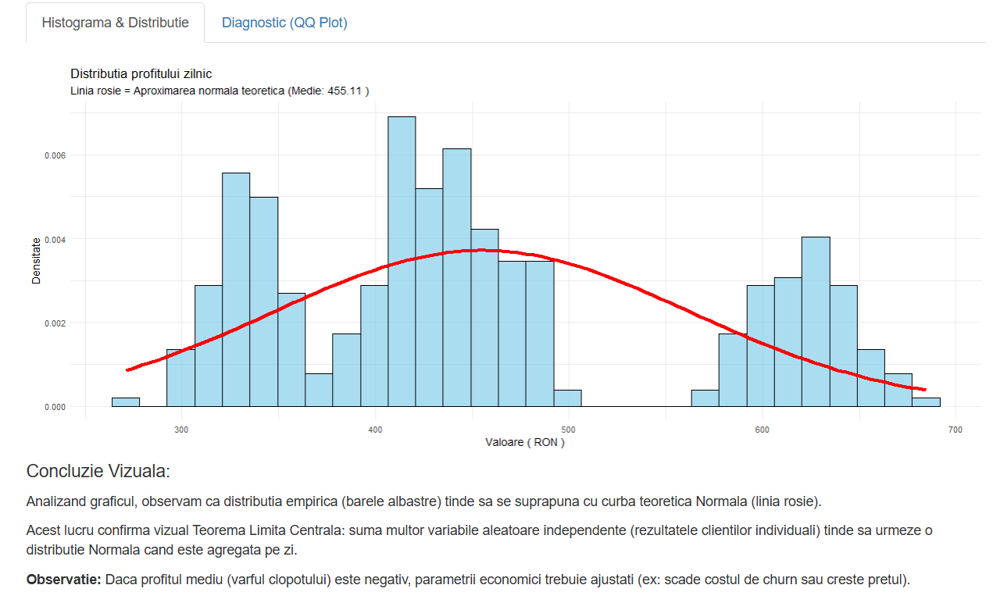
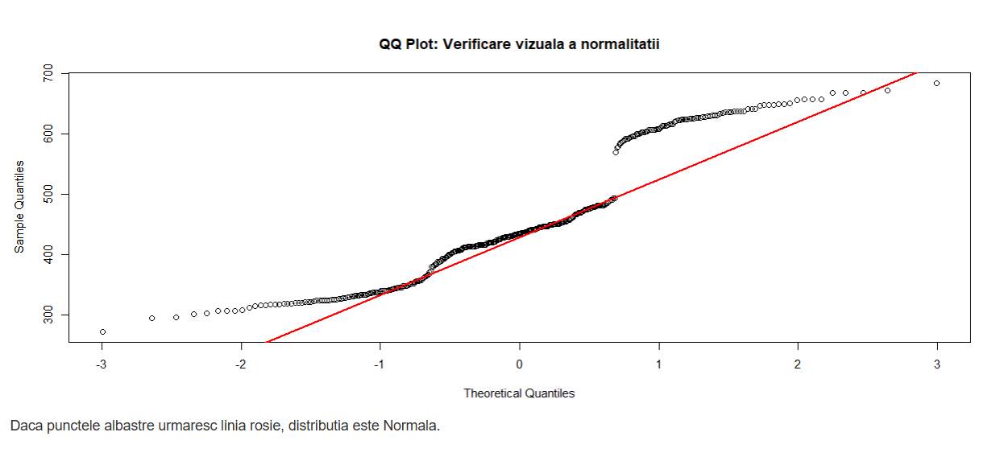
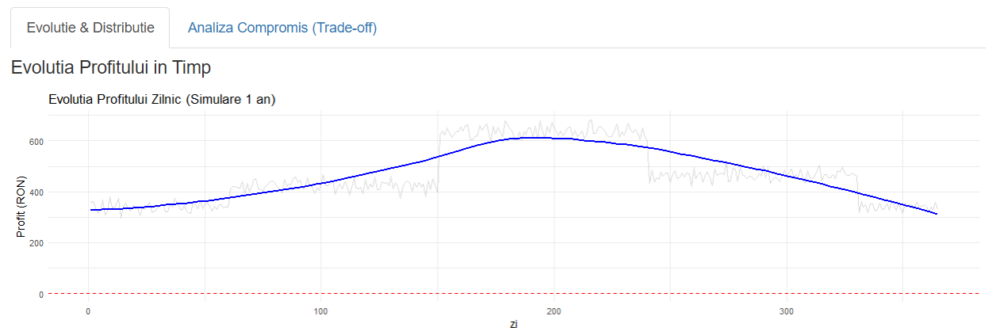
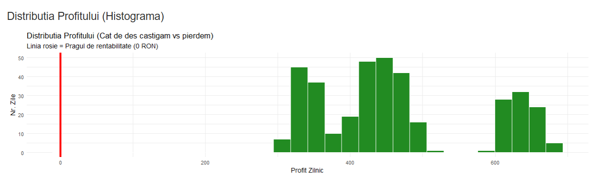

# Analiza Performanței Traficului în R

## Membrii Echipei:
*   **Donea Fernando-Emanuel**
*   **Roșca Teodora-Maia**
*   **Rachieru Gheorghe Gabriel**
*   **Bulacu Daria**

---

# Introducere Generală

Acest proiect reprezintă o analiză a performanței traficului într-un sistem informatic, realizată folosind limbajul R. Scopul principal este modelarea probabilistică a comportamentului utilizatorilor și a sistemului de servire, pornind de la nivel micro (sosirea unui client, prelucrarea unei cereri) până la nivel macro (profitabilitate anuală, analiză de risc).

Lucrarea integrează concepte fundamentale din teoria probabilităților și statistică, precum distribuții discrete și continue (Poisson, Binomială, Exponentială, Gamma, Normală), Teorema Limită Centrală, și inegalități probabilistice (Markov, Cebîșev). Prin intermediul simulărilor Monte Carlo și a vizualizărilor interactive implementate în Shiny, proiectul oferă o perspectivă practică asupra modului în care parametrii tehnici influențează performanța și sustenabilitatea economică a unui sistem.

Documentația este structurată pe exerciții care abordează progresiv complexitatea sistemului, fiecare capitol aducând noi straturi de analiză: de la generarea traficului, la gestionarea erorilor, dependențe între variabile și impact financiar.

---

# Documentație Cerința 1: Modelarea Traficului Zilnic

Autor: Donea Fernando-Emanuel

Modelarea traficului zilnic (variabile aleatoare discrete)

- a) Modelați 𝐾𝑑 folosind, pe rȃnd, cel puțin două distribuții discrete (ex.: Poisson,
Binomială).

- b) Generați prin simulare eșantioane mari care să reprezinte traficul zilnic pentru o perioadă
de cȃțiva ani și reprezentați histogramele asociate acestora. Interpretați comparativ
histogramele obținute pe luni și pe ani.

- c) Estimați empiric media și varianța traficului pentru fiecare an și comparați cu valorile
teoretice.

- d) Interpretați diferențele între modele (trafic redus vs plafonat).

## 1. Descrierea Problemei

Această cerință vizează simularea și vizualizarea traficului zilnic de clienți într-un sistem comercial, reprezentând primul pas în analiza performanței. Într-un context real, sosirile clienților sunt fenomene influențate de factori precum capacitatea sistemului și perioada din an.

Scopul este de a construi un model flexibil care să permită comutarea între două tipuri fundamentale de distribuții (Poisson pentru trafic nelimitat și Binomial pentru trafic cu capacitate finită) și integrarea sezonalității. Analiza vizuală a acestor date simulate permite înțelegerea modului în care parametrii statistici și variațiile sezoniere influențează încărcarea sistemului pe termen lung și scurt.

## 2. Aspecte Teoretice

Modelarea se bazează pe următoarele concepte de probabilități:

*   **Procesul Poisson (Trafic "Natural"):**
    Folosit pentru a modela numărul de evenimente care apar într-un interval fix de timp, când aceste evenimente au loc cu o rată medie constantă ($\lambda$) și independent de timpul scurs de la ultimul eveniment.
    $$ P(X=k) = \frac{\lambda^k e^{-\lambda}}{k!} $$
    Este ideal pentru sisteme deschise cu un număr teoretic infinit de potențiali clienți.

*   **Distribuția Binomială (Trafic "Plafonat"):**
    Modelează numărul de succese în $n$ încercări independente, fiecare cu probabilitatea $p$.
    $$ P(X=k) = \binom{n}{k} p^k (1-p)^{n-k} $$
    Este adecvat pentru sisteme cu capacitate finită (ex: număr maxim de locuri, număr limitat de abonați), unde $n$ este limita superioară.

*   **Sezonalitatea**
    Introducerea variației în timp a parametrilor ($\lambda_t$ sau $n_t$). Traficul nu este uniform: el variază în funcție de anotimp, necesitând ajustarea parametrilor de bază cu factori multiplicativi (ex: $\lambda_{vara} = \lambda_{baza} \times 1.5$).

## 3. Reprezentări Grafice

Proiectul include vizualizări interactive esențiale pentru explorarea datelor:

1.  **Histograme Anuale:**
    *   Prezintă distribuția globală a numărului de clienți pentru fiecare an simulat.
    *   Permite verificarea stabilității macroscopice a sistemului pe termen lung.

  

2.  **Histograme Lunare:**
    *   O matrice de grafice care descompune traficul pe Ani și Luni.
    *   Utilizează coduri de culoare pentru anotimpuri (Iarna-Albastru, Vara-Portocaliu, etc.) pentru a evidenția vizual impactul sezonalității.
    *   Permite observarea rapidă a diferențelor de medie și dispersie între sezoane.

  
    

3.  **Vizualizare Detaliată:**
    *   Funcționalitate ce permite utilizatorului să dea click pe o lună specifică din situația globală pentru a o analiza în detaliu ("Zoom in").


## 4. Pachete Software și Surse de Inspirație

### Pachete R utilizate:
*   `shiny`: Pentru arhitectura aplicației web și logica reactivă (`reactive`, `observe`, `req`).
*   `ggplot2`: Pentru construirea declarativă a graficelor statistice.
*   `plotly`: Pentru a adăuga interactivitate graficelor `ggplot2` și pentru gestionarea evenimentelor de mouse (`event_data`, `event_register`).
*   `dplyr`: Pentru manipularea datelor (grupări, filtrări, sumare statistice).


## 5. Codul și Comentarea Soluției

Soluția este structurată pentru a separa logica probabilistică de interfața utilizator. Funcțiile de bază se află în `R/ex1_trafic.R` și implementează modelele matematice discutate.

### 5.1 Funcțiile de Simulare Probabilistică

Generarea eșantioanelor aleatoare se realizează prin două funcții dedicate, care folosesc funcțiile standard din R (`rpois`, `rbinom`). Acestea reprezintă realizarea empirică a variabilei aleatoare $K_d$ (numărul de clienți pe zi).

```r
trafic_simulat_poisson <- function(zile, lambda_val) {
  # genera un esantion de valori discrete cu rpois
  # lambda_val poate fi scalar sau vector (pentru sezonalitate)
  rpois(zile, lambda = lambda_val)
}

trafic_simulat_binomiala <- function(zile, n_val, p_val) {
  # modelam traficul cu plafon maxim(n) cu rbinom
  rbinom(zile, size = n_val, prob = p_val)
}
```

### 5.2 Funcțiile Teoretice

Pentru a compora propabilitatățile empirice,avem funcții care returnează proprietățile teoretice (momentele statistice) ale distribuțiilor utilizate. Aceste valori servesc drept valori teoretice pentru validarea simulării.

```r
trafic_teoretic_poisson <- function(lambda_val) {
  # La distributia Poisson, media = varianta = lambda
  return(list(m = lambda_val, v = lambda_val))
}

trafic_teoretic_binomiala <- function(n_val, p_val) {
  # La Binomiala: Media = n*p, Varianta = n*p*(1-p)
  medie <- n_val * p_val
  varianta <- n_val * p_val * (1 - p_val)
  return(list(m = medie, v = varianta))
}
```

### 5.3 Generarea Datelor și a Sezonalității ($K_d$)

Cea mai complexă parte a algoritmului este integrarea sezonalității. Rata medie de sosire nu este constantă, ci depinde de factorul sezonier $S_t$.

Algoritmul parcurge următorii pași:
1.  **Generarea axei temporale**: Se construiește un vector al lunilor și anotimpurilor pentru întreaga perioadă simulată (ani $\times$ 365 zile).
2.  **Aplicarea factorilor sezonieri**: Se asociază fiecărei zile un multiplicator bazat pe anotimp (Iarna: 0.8, Primăvara: 1.0, Vara: 1.5, Toamna: 1.1).
3.  **Ajustarea parametrilor**:
    *   Pentru **Poisson**: $\lambda_{zi} = \lambda_{input} \times factor_{sezon}$
    *   Pentru **Binomial**: $n_{zi} = round(n_{input} \times factor_{sezon})$

```r
#  Generare K_d cu parametri ajustati
K_d <- if (distributie == "Poisson") {
  # lambda variaza in functie de zi
  lambda_vec <- input_lambda * vec_factori
  # rpois accepta vector pentru lambda, generand un proces Poisson neomogen
  rpois(zile_totale, lambda = lambda_vec)
} else {
  # Capacitatea maxima (N) variaza in functie de zi
  n_vec <- round(input_n * vec_factori)
  rbinom(zile_totale, size = n_vec, prob = input_p)
}
```

### 5.4 Structura Datelor (Dataframe-ul)

Datele rezultate sunt organizate într-un `data.frame` numit date_trafic, necesar pentru vizualizarea ulterioară cu `ggplot2`. Fiecare rând reprezintă o observație unică (o zi).

| zile (index) | anul | luna | clienti ($K_d$) | 
| :--- | :--- | :--- | :--- |
| 1 | 1 | 1 (IAN) | 85 |
| ... | ... | ... | ... |
| 200 | 1 | 7 (IUL) | 145 |

Această structură permite gruparea ușoară după `anul` sau `luna` pentru calculul statisticilor agregate.

### 5.5 Generarea Histogramelor

Vizualizarea distribuțiilor de probabilitate simulate se realizează prin trei tipuri distincte de histograme.

#### A. Histogramele Anuale 
Prima vizualizare agregă datele la nivel de an. 

```r
output$plot_trafic_anual <- renderPlotly({
  # ...
  ggplot(date_trafic(), aes(x = clienti, ...)) +
    geom_histogram(fill = "skyblue", color = "black", bins = 30) +
    facet_wrap(~anul) + # Un grafic separat pentru fiecare an
    labs(title = "Distributia Traficului pe Ani")
})
```
Din punct de vedere probabilistic, ne așteptăm ca forma acestor histograme să fie aproape identică de la un an la altul (datorită legii numerelor mari).

#### B. Histogramele Lunare 
Această vizualizare descompune distribuția anuală în componentele sale lunare.

```r
# Vizualizare matriciala: Ani x Luni
ggplot(dt, aes(x = clienti, fill = anotimp)) +
  geom_histogram(color = NA, bins = 15) +
  facet_grid(anul ~ luna_nume) + # Grila bidimensionala
  scale_fill_manual(...) # Culori specifice fiecarui anotimp
```
Aceasta este vizualizare permite validarea modelului sezonier. Se poate observa vizual cum media distribuției  se deplasează spre dreapta în lunile de vară (trafic intens) și spre stânga iarna.

#### C. Histograma Detaliată (Analiza Distribuției Locale)
Prin mecanismul de interactivitate, utilizatorul poate izola o singură lună. Aceasta permite inspecția detaliată a funcției de masă de probabilitate pentru, de exemplu, "Luna Iulie, Anul 2".

```r
# Se activeaza doar la click pe o celula din grid-ul de mai sus
df_filtrat <- dt %>% filter(anul == sel_an, luna == sel_luna)

ggplot(df_filtrat, aes(x = clienti, fill = anotimp)) +
  geom_histogram(color = "black", bins = 30) +
  labs(title = paste("Distributia Traficului - Anul", sel_an, "Luna", sel_luna))
```


## 6. Concluzii

1.  Simularea demonstrează că alegerea distribuției (Poisson vs Binomial) influențează fundamental dispersia datelor: modelul Binomial prezintă sub-dispersie (varianța < media) datorită plafonării capacității.
2.  Integrarea sezonalității este crucială pentru realism; mediile globale ascund variații locale masive care pot pune presiune pe sistem în perioadele de vârf (Vara).

---

# Documentație Cerința 2: Modelarea Timpilor de Răspuns (Variabile Continue)

Autor: Roșca Teodora-Maia

## 1. Descrierea Problemei

Această cerință abordează modelarea timpilor de răspuns (latența) într-un sistem de servire. Timpul de răspuns este o variabilă continuă esențială pentru evaluarea performanței (Quality of Service).
Obiectivul este de a simula acești timpi folosind distribuții de probabilitate continue și de a analiza proprietățile lor statistice (media, varianța, mediana, modul). De asemenea, se dorește compararea distribuțiilor simetrice (Normală) cu cele asimetrice (Gamma), care sunt adesea modele mai realiste pentru latență (unde există valori "coadă lungă" - long tail).

## 2. Aspecte Teoretice

Modelarea se bazează pe variabile aleatoare continue:

*   **Distribuția Gamma:**
    Este adesea utilizată pentru a modela timpii de așteptare. Este definită de doi parametri:
    *   Forma ($\alpha$ sau `shape`): controlează forma distribuției.
    *   Rata ($\beta$ sau `rate`): inversul scalei.
    Media este $E[X] = \alpha / \beta$, iar Varianța $Var(X) = \alpha / \beta^2$. Este potrivită pentru fenomene unde valorile sunt strict pozitive și asimetrice.

*   **Distribuția Normală (Gaussiană):**
    Clopotul lui Gauss, definit de Medie ($\mu$) și Deviația Standard ($\sigma$).
    În contextul latenței, folosim o distribuție normală trunchiată (valori $\ge 0.1$ ms), deoarece timpul nu poate fi negativ. Este utilă pentru procese stabile, simetrice în jurul mediei.

*   **Indicatori Statistici:**
    *   **Media:** Centrul de greutate al distribuției.
    *   **Mediana:** Valoarea care împarte eșantionul în două jumătăți egale (robustă la valori extreme).
    *   **Modul:** Valoarea cea mai frecventă (vârful densității).

## 3. Reprezentări Grafice

1.  **Graficul Densității de Probabilitate:**
    *   O histogramă a datelor simulate suprapusă cu curba teoretică a densității (PDF - Probability Density Function).
    *   Permite validarea vizuală a simulării (“cât de bine se potrivește modelul teoretic pe datele empirice”).


2.  **Statistici Descriptive:**
    *   Tabel comparativ între valorile empirice (calculate din date) și cele teoretice (din formule).
  
  
  

## 4. Pachete Software și Surse

### Pachete R utilizate:
*   `shiny`: Pentru interfața interactivă și reactivitate.
    *   *Funcționalitate cheie:* `moduleServer` pentru modularizare (izolarea logicii exercițiului), `eventReactive` pentru declanșarea simulării doar la apăsarea butonului.
*   `ggplot2`: Pentru vizualizare.
    *   *Funcționalitate cheie:* `geom_histogram` pentru datele empirice și `stat_function` pentru trasarea curbei teoretice exacte (`dgamma`, `dnorm`) peste histogramă.

### Surse de informație:
*   Documentația R pentru distribuții: `?rgamma`, `?rnorm`.
*   Teoria cozilor (Queueing Theory) pentru utilizarea distribuției Gamma în timpii de servire.

## 5. Codul și Comentarea Soluției

Soluția separă logica de simulare (`R/ex2_latenta.R`) de interfață (`Shiny/ex2_latenta_UI.R`).

### 5.1 Simularea Datelor

Funcția `simuleaza_latenta` generează eșantionul aleator. Se observă tratarea cazului Normal pentru a evita valori negative (folosind `pmax`).

```r
simuleaza_latenta <- function(n, tip, param1, param2) {
  if (tip == "Gamma") {
    # rgamma genereaza valori conform distributiei Gamma
    return(rgamma(n, shape = param1, rate = param2))
  } else {
    # rnorm genereaza valori normale
    val <- rnorm(n, mean = param1, sd = param2)
    # pmax(0.1, val) asigura ca nu avem timpi negativi sau zero
    return(pmax(0.1, val))
  }
}
```

### 5.2 Calculul Modului Empiric

Pentru distribuții continue, "modul" sau valoarea modală este vârful densității. Estimăm acest lucru folosind funcția `density` din R (Kernel Density Estimation).

```r
calculeaza_mod_empiric <- function(x) {
  d <- density(x)          # Calculeaza densitatea estimata
  return(d$x[which.max(d$y)]) # Returneaza x-ul corespunzator maximului y
}
```

### 5.3 Reactivitatea în Shiny

Folosim `req()` pentru a ne asigura că inputurile sunt valide înainte de a rula codul, prevenind erorile în UI.

```r
output$plot_latenta <- renderPlot({
  req(date_latenta(), input$p1, input$p2)
  # ... cod de plotare ...
})
```

## 6. Concluzii

1.  **Diferența Medie vs Mediană:** În cazul distribuției Gamma (asimetrice), media este trasă spre dreapta de valorile mari (coada lungă), în timp ce mediana rămâne un indicator mai bun al "cazului tipic".
2.  **Validarea Modelului:** Suprapunerea curbei teoretice peste histogramă confirmă corectitudinea generatorului de numere aleatoare.

---

# Documentație Cerința 3: Cereri, Retry-uri și Evenimente

Autor: Donea Fernando-Emanuel


3. Cereri, retry-uri și evenimente
Definiți evenimentele:
    - 𝐴 = {𝐼 = 1} (succes);
    - 𝐵 = {𝑇 ≤ 𝑡0} (SLA);
    - 𝐶 = {𝑁 ≤ 𝑛0};
    - 𝐷 = {cel puțin un eșec}.

- a) Estimați empiric: 𝑃(𝐴), 𝑃(𝐵), 𝑃(𝐶), 𝑃(𝐴 ∩ 𝐵), 𝑃(𝐴 ∪ 𝐷)

- b) Verificați numeric formulele pentru reuniune/intersecție

- c) Explicați de ce probabilitatea empirică aproximează bine probabilitatea teoretică.

## 1. Descrierea Problemei

În analiza disponibilității și performanței serviciilor web, comportamentul unei cereri nu este binar (succes/eșec imediat). Adesea, sistemele implementează mecanisme de "Retry" (reîncercare) pentru a masca erorile tranzitorii. Această cerință își propune să analizeze probabilistic ciclul de viață al unei cereri într-un astfel de sistem.

Definim formal patru evenimente fundamentale care descriu starea sistemului:
*   **Evenimentul A (Succes Global):** Cererea este servită cu succes, fie din prima încercare, fie în urma unor reîncercări ($\{I = 1\}$).
*   **Evenimentul B (SLA Respectat):** Timpul total de răspuns ($T$) este mai mic decât o limită critică $t_0$ ($\{T \le t_0\}$). Acesta este un indicator de calitate a serviciului
*   **Evenimentul C (Efort Redus):** Numărul de reîncercări necesare ($N$) este sub un prag $n_0$ ($\{N \le n_0\}$)
*   **Evenimentul D (Instabilitate):** Apare **cel puțin un eșec** pe parcursul procesării ($\{N \ge 1\}$). Deși cererea poate reuși eventual (A), existența lui D indică probleme de infrastructură.

Scopul este de a estima probabilitățile acestor evenimente (și a intersecțiilor/reuniunilor lor) atât **empiric** (prin simulare Monte Carlo), cât și **teoretic** (folosind formule probabilistice exacte).

## 2. Aspecte Teoretice

Calculul probabilităților se bazează pe proprietățile variabilelor aleatoare geometrice (pentru numărul de încercări) și a sumelor de variabile exponențiale (distribuția Gamma, pentru timp).

Fie $p$ probabilitatea de succes a unei singure încercări și $q = 1-p$ probabilitatea de eșec.
Fie $k_{max}$ numărul maxim de reîncercări admise.

*   **Probabilitatea de Succes (A):**
    Este complementul evenimentului "toate cele $k_{max} + 1$ încercări eșuează".
    $$ P(A) = 1 - P(\text{toate eșuează}) = 1 - q^{k_{max}+1} $$

*   **Probabilitatea de Instabilitate (D):**
    D este echivalent cu faptul că prima încercare a eșuat.
    $$ P(D) = q $$

*   **Probabilitatea de a Respecta SLA (B):**
    Evenimentul B ($\{T \le t_0\}$) se poate realiza fie printr-un succes rapid, fie printr-un eșec rapid. Folosind Formula Probabilității Totale:
    $$ P(B) = P(A \cap B) + P(A^c \cap B) $$
    Unde $P(A^c \cap B)$ este probabilitatea de a eșua toate încercările, dar într-un timp mai scurt decât $t_0$ (ceea ce tehnic respectă SLA-ul de timp, deși cererea eșuează).
    $$ P(A^c \cap B) = q^{k_{max}+1} \times P(T_{fail} \le t_0) $$
    ($T_{fail}$ suma a $k_{max}+1$ latențe).

*   **Probabilitatea de Efort Redus (C):**
    Evenimentul C ($\{N \le n_0\}$) însumează probabilitățile ca procesul să se termine (cu succes sau eșec) în maxim $n_0$ reîncercări.
    $$ P(C) = \sum_{k=0}^{\min(n_0, k_{max})} P(N=k) $$
    Distribuția lui N este:
    - $P(N=k) = q^k p$ pentru $k < k_{max}$ (Succes la reîncercarea $k$)
    - $P(N=k_{max}) = q^{k_{max}}$ (Se atinge limita maximă de reîncercări)

*   **Intersecția A și B ($A \cap B$):**
    Reprezintă un succes obținut într-un timp util. Deoarece timpul total este suma timpilor încercărilor individuale (fiecare distribuit exponernțial $\sim Exp(\lambda)$), timpul după $k$ încercări urmează o distribuție Gamma $\sim \Gamma(k, \lambda)$.
    $$ P(A \cap B) = \sum_{k=1}^{k_{max}+1} P(\text{succes exact la încercarea } k) \times P(T_k \le t_0) $$
    Unde $P(T_k \le t_0)$ este funcția de repartiție a distribuției Gamma (în R: `pgamma`).

*   **Reuniunea A și D ($A \cup D$):**
    Probabilitatea ca cel puțin unul dintre evenimente să aibă loc se calculează folosind Principiul Includerii și Excluderii:
    $$ P(A \cup D) = P(A) + P(D) - P(A \cap D) $$
    Această formulă este esențială pentru a evita dubla contorizare a cazurilor comune (succes obținut după cel puțin un eșec).

## 3. Pachete Software

*   **Simulare:** `stats` (funcțiile `rexp` pentru generare exponențială, `runif` pentru decizie succes/eșec, `pgamma` pentru calcul teoretic).
*   **Interfață și Logică:** `shiny` pentru a permite modificarea dinamică a parametrilor ($p$, $t_0$, $n_0$) și recalcularea instantanee a probabilităților.

## 4. Codul și Comentarea Soluției

Soluția este implementată în fișierul `R/ex3_evenimente.R`.

### 4.1 Simularea Evenimentelor (Metoda Monte Carlo)

Funcția `simuleaza_evenimente` generează $N$ scenarii independente. În fiecare scenariu, simulăm procesul iterativ de retry:
1.  Se generează latența pentru încercarea curentă (`rexp`).
2.  Se decide succesul sau eșecul (`runif(1) <= prob_succes`).
3.  Dacă eșuează, se incrementează contorul și se reîncearcă (până la $k_{max}$).
4.  La final, se stochează statusul indicator ($I$), timpul total ($T$) și numărul de retry-uri ($N$).

### 4.2 Verificarea Numerică (Teoretic vs Empiric)

Pentru fiecare eveniment, comparăm frecvența relativă din simulare cu formula exactă.

**Exemplu calcul teoretic (din `calc_teoretic`):**
```r
# Probabilitatea evenimentului A (Succes Eventual)
prob_A <- 1 - q^(k_max + 1)

# Probabilitatea evenimentului D (Cel putin un esec)
prob_D <- q

# Intersectia A si B (Teorema Probabilitatii Totale)
# Sumam probabilitatea de a reusi exact la pasul i, inmultita cu probabilitatea ca timpul sa fie bun
prob_A_si_B <- 0
for (i in 1:(k_max + 1)) {
    prob_scenariu_succes <- q^(i - 1) * p
    # pgamma calculeaza probabilitatea ca suma a i variabile exponentiale sa fie <= t0
    prob_A_si_B <- prob_A_si_B + prob_scenariu_succes * pgamma(t0, shape = i, rate = lambda)
}
```

### 4.3 Validarea Relațiilor dintre Mulțimi

O cerință specifică este verificarea formulelor pentru reuniune și intersecție. Codul include verificări explicite în interfața Shiny:

**1. Verificarea Reuniunii ($A \cup D$):**
$$ P(A \cup D) = P(A) + P(D) - P(A \cap D) $$
În aplicație, această egalitate este confirmată numeric:
> = 0.9990 + 0.3000 - 0.2990
> = 1.0000

**2. Verificarea Intersecției ($A \cap B$):**
Folosind aceeași logică, verificăm consistența intersecției dedusă din reuniune:
$$ P(A \cap B) = P(A) + P(B) - P(A \cup B) $$
Acest lucru confirmă că estimatorii empirici respectă axiomele de probabilitate și că nu există discrepanțe logice în modul de calcul al evenimentelor compuse.

## 5. Concluzii

1.  **Convergența:** Rezultatele afișate în tabel arată erori absolute neglijabile (de ordinul $10^{-3}$ sau $10^{-4}$) între valorile simulate și cele teoretice. Aceasta validează implemetarea simulării și confirmă Legea Numerelor Mari.
2.  **Impactul Retry-urilor:** Analiza evenimentului $D$ vs $A$ ne arată că un sistem poate fi "fiabil" ($P(A) \approx 1$) chiar dacă este "instabil" ($P(D)$ mare), datorită mecanismului de retry. Totuși, acest lucru vine cu costul latenței (impact asupra $P(B)$).
3.  **Compromisul Performanță-Fiabilitate:** Creșterea numărului maxim de retry-uri ($k_{max}$) crește $P(A)$ (succesul), dar scade $P(B)$ (respectarea SLA) deoarece cererile reîncercate durează mai mult.

---

# Documentație Cerința 4: Variabile Bidimensionale Discrete (N, F)

Autor: Roșca Teodora-Maia

## 1. Descrierea Problemei

Această cerință explorează relația dintre două variabile aleatoare discrete într-un proces de autentificare/reîncercare:
*   $N$: Numărul total de încercări efectuate (până la succes sau epuizarea încercărilor).
*   $F$: Numărul de eșecuri întâmpinate.

Scopul este analiza distribuției comune (joint distribution) a perechii $(N, F)$ și verificarea independenței statistice dintre cele două variabile.

## 2. Aspecte Teoretice

*   **Variabila Aleatoare Bidimensională $(X, Y)$:**
    Este o funcție care asociază fiecărui rezultat din spațiul de eșantionare o pereche de numere reale. În cazul nostru, spațiul este discret.
    Probabilitatea comună este $P(N=n, F=f)$.

*   **Distribuții Marginale:**
    Probabilitatea de a observa doar una dintre variabile, ignorând-o pe cealaltă.
    $$ P(N=n) = \sum_{f} P(N=n, F=f) $$

*   **Independența:**
    Două variabile sunt independente dacă $P(N=n, F=f) = P(N=n) \times P(F=f)$ pentru orice pereche $(n, f)$.
    Invers, dependența înseamnă că informația despre una ne influențează cunoștințele despre cealaltă.

## 3. Reprezentări Grafice

1.  **Heatmap (Distribuția Comună):**
    *   O matrice colorată unde intensitatea culorii reprezintă probabilitatea $P(N, F)$.
    *   Permite vizualizarea rapidă a combinațiilor frecvente (ex: $N=1, F=0$ pentru succes din prima).
  
  


2.  **Grafice Marginale:**
    *   Histograma pentru $N$ și Histograma pentru $F$ separate.
    *   Arată comportamentul individual al fiecărei variabile.
  
  


## 4. Pachete Software și Surse

### Pachete R utilizate:
*   `reshape2`: Funcția `melt` (implicită în manipularea dataframe-urilor pentru ggplot) este folosită pentru a transforma matrici în format "long" pentru vizualizare. Aici este importantă transformarea tabelului de frecvență.
*   `plotly`: Pentru heatmap interactiv.
    *   *Funcționalitate cheie:* `ggplotly` cu tooltip personalizat (`text = ...`) pentru a afișa probabilitatea exactă la mouse hover.
*   `gridExtra`: Pentru a afișa graficele marginale unul lângă altul (`grid.arrange`).

### Surse de informație:
*   Manual R: `?chisq.test`, `?table`.
*   Teoria Probabilităților: Definiția independenței variabilelor aleatoare.

## 5. Codul și Comentarea Soluției

Soluția este implementată în `R/ex4_variabile_bidim_discrete.R`.

### 5.1 Algoritmul de Simulare

Simularea reflectă procesul logic: executăm încercări până la succes sau până la limita maximă.
Variabilele $N$ și $F$ sunt calculate la fiecare pas.

```r
simuleaza_NF <- function(...) {
    # ...
    for(k in 1:total_posibile) {
        if(runif(1) <= p_succes) {
            # Succes la incercarea k
            n_curent <- k
            f_curent <- k - 1 # Au fost k-1 esecuri inainte
            break
        }
        # In caz de esec, continuam
    }
    # ...
}
```

### 5.2 Construirea Heatmap-ului

Transformăm tabelul de contingență într-un `data.frame` pentru a-l putea plota cu `ggplot2`.

```r
# Tabela de frecventa (contingenta)
tbl <- table(factor(df$N), factor(df$F))
# Conversie pentru ggplot
df_heatmap <- as.data.frame(tbl) 
# Calcul probabilitati
df_heatmap$Probabilitate <- df_heatmap$Frecventa / sum(df_heatmap$Frecventa)

# Plotare
ggplot(df_heatmap, aes(x=N, y=F, fill=Probabilitate)) + geom_tile() ...
```

### 5.3 Verificarea Empirică a Independenței

Verificăm direct condiția de independență:

$$ P(N=n, F=f) \stackrel{?}{=} P(N=n) \times P(F=f) $$

Calculăm diferența maximă dintre probabilitățile comune observate și cele teoretice (presupunând independența). Dacă această diferență este semnificativă (> 0.01), inseamnă că variabilele sunt dependente.

```r
# Calculam diferenta maxima
diff_matrix <- abs(comuna - teoretic_indep)
max_diff <- max(diff_matrix)
```

Rezultatul arată întotdeauna o diferență mare, confirmând dependența. (Logic: $F$ depinde direct de $N$).

## 6. Concluzii

1.  **Dependența Puternică:** $N$ și $F$ sunt intrinsec legate. Cunoașterea numărului de încercări ($N$) oferă informații precise despre numărul posibil de eșecuri ($F$), restrângând domeniul posibil la $\{N-1, N\}$.
2.  **Vizualizarea:** Heatmap-ul evidențiază clar faptul că doar anumite perechi $(N, F)$ sunt posibile (diagonala și sub-diagonala), restul având probabilitate zero.

---

# Documentație Cerința 5: Variabile Bidimensionale (N, T) - Discret & Continuu

Autor: Roșca Teodora-Maia

## 1. Descrierea Problemei

Această cerință analizează relația dintre o variabilă discretă și una continuă într-un sistem de reîncercare:
*   $N$: Numărul de încercări (discret).
*   $T$: Timpul total scurs până la finalizare (continuu).

Deoarece fiecare încercare adaugă o latență la timpul total, ne așteptăm la o corelație puternică între cele două. Scopul este cuantificarea acestei relații și vizualizarea ei.

## 2. Aspecte Teoretice

*   **Relația dintre N și T:**
    Matematic, $T$ este o sumă aleatoare de variabile aleatoare:
    $$ T = \sum_{i=1}^{N} L_i $$
    unde $L_i$ este latența încercării $i$. Deoarece $N$ este aleator, $T$ depinde direct de $N$.

*   **Covarianța ($Cov(N, T)$):**
    Măsoară direcția relației liniare.
    *   $Cov > 0$: Când $N$ crește, $T$ tinde să crească.
    *   Definiție: $E[(N - E[N])(T - E[T])]$.
    Dezavantaj: Valoarea depinde de scara de măsură (ms vs secunde).

*   **Coeficientul de Corelație Pearson ($\rho$):**
    Versiunea standardizată a covarianței, cu valori între -1 și 1.
    $$ \rho_{N,T} = \frac{Cov(N, T)}{\sigma_N \sigma_T} $$
    *   $\rho \approx 1$: Corelație pozitivă liniară puternică.

## 3. Reprezentări Grafice

**Boxplot (Distribuție Condiționată):**
Deoarece $N$ ia valori discrete puține (1, 2, 3...), este ideal să vizualizăm distribuția lui $T$ pentru fiecare valoare a lui $N$.
*   Axa X: Numărul de încercări ($N$).
*   Axa Y: Timpul Total ($T$).
*   Fiecare "cutie" arată mediana și dispersia timpului pentru un număr fix de încercări. Se observă clar cum cutiile "urcă" pe axa Y odată cu creșterea lui $N$.


## 4. Pachete Software și Surse

### Pachete R utilizate:
*   `stats`: Pachetul de bază din R care conține funcțiile `cor` și `cov`.
*   `ggplot2` & `plotly`:
    *   *Funcționalitate cheie:* `geom_boxplot` pentru vizualizarea relației discret-continuu.

### Surse de informație:
*   Manual R: `?cor`, `?cov`.
*   Statitică descriptivă: Interpretarea coeficientului Pearson.

## 5. Codul și Comentarea Soluției

Soluția este în `R/ex5_variabile_bidim_discrete_si_continue.R`.

### 5.1 Simularea Mixtă

Funcția de simulare generează succesiv latențe și verifică condiția de oprire.

```r
simuleaza_NT <- function(...) {
    # ...
    for(k in 1:total_posibile) {
        # Generare latenta L_k
        l <- rnorm(1, mean=latenta_medie, sd=latenta_sd)
        timp_total <- timp_total + l # T acumuleaza L_k
        
        if(runif(1) <= p_succes) break
    }
    # ...
}
```

### 5.2 Calculul Statisticilor

Folosim funcțiile standard pentru a popula tabelul de rezultate.

```r
cov_val <- cov(df$N, df$T)
cor_val <- cor(df$N, df$T)
```
Rezultatul tipic pentru `cor_val` va fi > 0.9, confirmând legătura mecanică directă dintre numărul de pași și durata totală.

### 5.3 Vizualizarea Boxplot

Este important să tratăm $N$ ca un **factor** (variabilă categorică) pentru ggplot, altfel ar putea încerca să deseneze un scatter plot sau o singură cutie.

```r
# aes(x=factor(N), y=T) este esential
ggplot(df, aes(x=factor(N), y=T, fill=factor(N))) +
    geom_boxplot()
```

## 6. Concluzii

1.  **Liniaritate:** Relația dintre $N$ și $T$ este aproape liniară, deoarece fiecare pas adaugă, în medie, o constantă (media latenței) la timpul total.
2.  **Variabilitate:** Variabilitatea lui $T$ crește ușor odată cu $N$ (suma mai multor variabile aleatoare are o varianță mai mare), lucru vizibil prin "lungirea" cutiilor din boxplot pentru $N$ mare.

---

# Documentație Cerința 6: Probabilități Condiționate

Autor: Rachieru Gheorghe Gabriel

## 1. Descrierea Problemei

Exercițiul 6 își propune să rafineze analiza performanței prin calcularea unor probabilități condiționate esențiale. Nu este suficient să știm probabilitatea generală de succes ($P(A)$) sau timpul mediu total ($E[T]$). Pentru o înțelegere mai profundă a sistemului, trebuie să răspundem la întrebări precum:

1.  **"Cât de probabil este succesul dacă am depus un efort mic?"** - Aceasta ne spune dacă succesul este corelat cu rezolvarea rapidă a cererii.
2.  **"Dacă avem succes, care este șansa să fi fost și rapizi?"** - Aceasta leagă fiabilitatea de calitatea serviciului (SLA).
3.  **"Cât așteaptă utilizatorul în medie când reușește vs când eșuează?"** - Această metrică diferențiată este critică pentru User Experience (UX). Un eșec rapid este adesea preferabil unui eșec lent ("fail-fast").

## 2. Aspecte Teoretice

### 2.1 Formula Probabilității Condiționate
Probabilitatea condiționată a evenimentului $A$ dat fiind $B$ se definește ca:

$$ P(A | B) = \frac{P(A \cap B)}{P(B)} $$

Unde $P(A \cap B)$ este probabilitatea ca ambele evenimente să aibă loc simultan.

### 2.2 Media Condiționată
Valoarea așteptată (media) a unei variabile aleatoare $T$, condiționată de producerea unui eveniment $A$, este:

$$ E[T | A] = \frac{E[T \cdot \mathbb{1}_A]}{P(A)} $$

*   Numărătorul $E[T \cdot \mathbb{1}_A]$ reprezintă media valorilor $T$ doar pentru cazurile unde $A$ s-a întâmplat (restul fiind considerate 0).
*   Numitorul $P(A)$ normalizează rezultatul la submulțimea cazurilor favorabile.

## 3. Implementare

Codul sursă se află în `R/ex6_conditionate.R`.

### 3.1 Calculul $P(A | N \le n_0)$
*   **Eveniment A:** Succes ($I=1$).
*   **Condiție $N \le n_0$:** Număr redus de reîncercări.
*   *Implementare R:*
    ```r
    # P(N <= n0)
    prob_Conditie_N <- mean(col_NrIncercari <= prag_retry_mic)
    # P(A si N <= n0)
    prob_Intersectie_A_N <- mean((col_Succes == 1) & (col_NrIncercari <= prag_retry_mic))
    # Rezultat
    prob_Succes_cond_RetryMic <- prob_Intersectie_A_N / prob_Conditie_N
    ```

### 3.2 Calculul $P(B | A)$
*   **Eveniment B:** Timp bun ($T \le t_0$).
*   **Condiție A:** Succes ($I=1$).
*   *Implementare R:* Calculăm proporția simulărilor care au avut ȘI timp bun ȘI succes, raportat la proporția totală de succese.

### 3.3 Calculul Mediilor Condiționate
*   **Timp Mediu Succes:** $E[T | I=1]$. Se calculează media timpilor `T` doar pentru rândurile unde `I=1`.
*   **Timp Mediu Eșec:** $E[T | I=0]$. Se calculează media timpilor `T` doar pentru rândurile unde `I=0`.


### 3.4 Rezultate Vizuale


## 4. Concluzii și Interpretare
Rezultatele obținute în interfața Shiny (Tab-ul 6) ne permit să observăm corelații interesante:

- De obicei, $E[T | Esec] > E[T | Succes]$ într-un sistem cu retry-uri, deoarece eșecul final implică adesea epuizarea tuturor încercărilor disponibile (timp maxim pierdut).
- $P(B|A)$ ne arată procentul real de utilizatori mulțumiți dintre cei care au primit totuși serviciul.

---

# Documentație Cerința 7: Analiza Dependenței

Autor: Rachieru Gheorghe Gabriel

## 1. Descrierea Problemei

În modelele simplificate de analiză a traficului (ex. Exercițiul 3), presupunem adesea **independența** între încercările succesive. Adică, dacă prima cerere eșuează și facem un retry, a doua cerere are aceleași șanse de succes și aceeași distribuție a timpului de răspuns ca prima.

Acest model idealizat nu surprinde fenomenul de **congestie**. Într-un sistem real, dacă o cerere eșuează (timeout, server ocupat), este foarte probabil ca serverul să fie supraîncărcat. Prin urmare:
1.  Probabilitatea de succes la retry ar putea scădea.
2.  Timpul de răspuns (latența) la retry ar putea crește.

Exercițiul 7 modelează acest scenariu de **dependență**, unde eșecurile anterioare influențează negativ performanța încercărilor viitoare.

## 2. Modelul de Dependență (Penalizarea Latenței)

Am ales să modelăm dependența prin creșterea timpului mediu de răspuns după fiecare eșec.

### 2.1 Distribuția Exponențială Variabilă
Timpul de răspuns pentru o încercare ( $S_i$ ) urmează o distribuție exponențială $Exp(\lambda)$.
Media acestei distribuții este $E[S_i] = \frac{1}{\lambda}$.

În scenariul independent, $\lambda$ este constant ($\lambda_0$).
În scenariul dependent, introducem un **factor de penalizare** $f > 1$ (ex: $f=1.5$).
Dacă încercarea $k$ eșuează, rata pentru încercarea $k+1$ devine:

$$ \lambda_{k+1} = \frac{\lambda_k}{f} $$


Deoarece media este inversul ratei, rezultă că timpul mediu crește:

$$ E[S_{k+1}] = E[S_k] \times f $$


Aceasta simulează faptul că serverul răspunde din ce în ce mai greu pe măsură ce insistăm în timpul unei congestii.

## 3. Implementare

Codul sursă se află în `R/ex7_dependenta.R`.

Funcția `simuleaza_dependenta` reia logica de simulare Monte Carlo, dar cu parametrii dinamici:

```r
rata_exponentiala_curenta <- 1 / latenta_medie_initiala 

for (nr_retry in 0:nr_max_retry) {
    # Generare timp cu rata curentă
    timp_raspuns_curent <- rexp(1, rate = rata_exponentiala_curenta)
    
    # Decizie succes/eșec
    if (runif(1) <= prob_succes_per_try) {
        ... (Succes) ...
    } else {
        # La EȘEC, penalizăm rata pentru următoarea iterație
        rata_exponentiala_curenta <- rata_exponentiala_curenta / factor_penalizare_latenta
    }
}
```

## 4. Compararea Rezultatelor


Interfața Shiny (Tab-ul 7) permite vizualizarea grafică comparativă între modelul Independent și cel Dependent.


**Observații:**

1.  **Distribuția Timpului Total ( $T$ ):** În cazul dependent, coada distribuției ("tail") se lungește semnificativ spre dreapta. Apar timpi totali mult mai mari decât în cazul independent.
2.  **Impactul asupra SLA:** Probabilitatea de a respecta SLA-ul ( $P(T \le t_0)$ ) scade dramatic în scenariul dependent, chiar dacă probabilitatea de succes final ( $P(A)$ ) rămâne similară (dacă numărul de retry-uri e suficient).

Această analiză demonstrează importanța mecanismelor de "Backoff" (așteptare exponențială) în sistemele distribuite, dar și riscul ca aceste mecanisme să crească latența totală percepută de utilizator.

---

# Documentație Cerința 8: Inegalități Probabilistice

Autor: Rachieru Gheorghe Gabriel

## 1. Descrierea Problemei

În proiectarea sistemelor fiabile, nu cunoaștem întotdeauna distribuția exactă a timpilor de răspuns sau a erorilor. Totuși, avem nevoie de garanții "worst-case". Teoria probabilităților oferă un set de inegalități clasice care pun limite asupra comportamentului variabilelor aleatoare, cunoscând doar media și varianța.

Exercițiul 8 verifică validitatea acestor limite teoretice pe datele noastre simulate. Scopul este dublu:
1.  Validarea corectitudinii simulării (dacă datele ar încălca o teoremă matematică, simularea ar fi greșită).
2.  Înțelegerea utilității acestor limite pentru estimări rapide ("Back-of-the-envelope calculations").

## 2. Inegalități Verificate

### 2.1 Inegalitatea lui Markov
Aceasta oferă o limită superioară pentru probabilitatea ca o variabilă aleatoare nenegativă să depășească o anumită valoare.

**Enunț:** Pentru orice variabilă aleatoare $X \ge 0$ și orice constantă $a > 0$:

$$ P(X \ge a) \le \frac{E[X]}{a} $$


**În contextul nostru:**
Probabilitatea ca timpul total $T$ să depășească un prag critic $a$ este cel mult media timpului împărțită la $a$.


### 2.2 Inegalitatea lui Cebîșev (Chebyshev)
Aceasta limitează probabilitatea ca o variabilă să devieze mult de la media sa, indiferent de distribuție.

**Enunț:** Fie $\mu = E[X]$ și $\sigma^2 = Var(X)$. Pentru orice $k > 0$:

$$ P(|X - \mu| \ge k\sigma) \le \frac{1}{k^2} $$


**În contextul nostru:**
Spune că timpii de răspuns "extremi" (foarte mici sau foarte mari față de medie) sunt rari. De exemplu, cel mult $1/4$ (25%) din cereri pot avea timpi deviați cu mai mult de $2\sigma$ față de medie.


### 2.3 Inegalitatea lui Jensen
Aceasta relaționează valoarea funcției aplicată mediei cu media funcției aplicate variabilei, pentru funcții convexe.

**Enunț:** Dacă $\varphi$ este o funcție convexă, atunci:

$$ \varphi(E[X]) \le E[\varphi(X)] $$


**În contextul nostru:**
Am ales funcția convexă $\varphi(x) = x^2$. Inegalitatea devine:

$$ (E[T])^2 \le E[T^2] $$

Aceasta este, de fapt, echivalentă cu proprietatea că varianța este nenegativă ($Var(T) = E[T^2] - (E[T])^2 \ge 0$).


## 3. Implementare și Verificare

Codul sursă se află în `R/ex8_inegalitati.R`.

Funcția `verificare_inegalitati`:
1.  Preia vectorul de timpi simulați $T$.
2.  Calculează statisticile descriptive: Media ($E[T]$), Deviația Standard ($SD[T]$).
3.  Pentru fiecare inegalitate, calculează separat:
    *   **Partea stângă (Empirică):** Numără cazurile din simulare care satisfac condiția (ex: proporția valorilor $\ge a$).
    *   **Partea dreaptă (Teoretică):** Aplică formula limitei (ex: $E[T]/a$).
4.  Compară cele două valori și returnează `TRUE` dacă inegalitatea este respectată.

## 4. Concluzii

Rularea verificărilor în Shiny (Tab-ul 8) confirmă că **toate inegalitățile sunt respectate** pe seturile de date simulate.

Acest lucru validează robustețea generatorului nostru de numere aleatoare și corectitudinea implementării logice. De asemenea, arată că limitele teoretice (deși adesea "slabe" sau conservatoare) sunt întotdeauna valabile și pot fi folosite pentru a dimensiona sistemul în lipsa unor date precise de distribuție.

---

# Documentație Cerința 9: Aproximarea Normală (Teorema Limită Centrală)

Autor : Bulacu Daria 

## 1. Descrierea Problemei

Această cerință își propune să analizeze comportamentul agregat al sistemului pe o perioadă extinsă de timp (de exemplu, un an sau mai mulți). Într-un sistem real, numărul zilnic de clienți este o variabilă aleatoare (modelată aici printr-un proces Poisson), iar rezultatul interacțiunii fiecărui client cu sistemul (latenta, succesul/eșecul, profitul generat) este, de asemenea, o variabilă aleatoare.

Scopul este de a studia distribuția sumelor acestor variabile aleatoare (ex: profitul total zilnic sau latența totală acumulată). Conform Teoremei Limită Centrale (CLT), ne așteptăm ca, pentru un număr mare de evenimente independente, această distribuție agregată să conveargă către o distribuție Normală (Gaussiana). Validarea acestei ipoteze permite simplificarea analizelor viitoare: în loc să rulăm simulări complexe Monte Carlo pentru fiecare scenariu, putem folosi formulele analitice ale distribuției Normale (bazate pe medie și deviație standard) pentru a estima riscurile și performanța.

## 2. Aspecte Teoretice


*   **Procese Poisson Neomogene:**
    Numărul de clienți $N(t)$ care sosesc într-o zi este modelat folosind o distribuție Poisson cu o rată $\lambda(t)$ care variază în funcție de sezonalitate (anotimp). Aceasta reflectă natura aleatoare a cererii într-un sistem de servere.

*   **Variabile Aleatoare Compuse (Compound Random Variables):**
    Variabila de interes $S$ (suma agregată pe zi) este definită ca:
    $$ S = \sum_{i=1}^{N} X_i $$
    Unde:
    *   $N$ este numărul aleator de clienți (Poisson).
    *   $X_i$ sunt variabile aleatoare independente și identic distribuite (i.i.d.) reprezentând rezultatul pentru clientul $i$ (profit sau latență).
    Aceasta este o sumă aleatoare de variabile aleatoare, un concept central în teoria riscului și teoria cozilor.

*   **Teorema Limită Centrală (CLT):**
    Această teoremă fundamentală afirmă că suma (sau media) a unui număr mare de variabile aleatoare independente și identic distribuite tinde către o distribuție normală, indiferent de forma distribuției originale a variabilelor individuale (cu condiția să aibă varianță finită).
    $$ \frac{S_n - n\mu}{\sigma\sqrt{n}} \xrightarrow{d} N(0, 1) $$
    În contextul nostru, chiar dacă latența individuală este exponențială (sau Gamma) și numărul de clienți este Poisson, distribuția totalului zilnic va avea o formă de "clopot" (Gaussiana).

## 3. Reprezentări Grafice

Proiectul include vizualizări esențiale pentru validarea ipotezei de normalitate:

1.  **Histograma cu Curba de Densitate Suprapusă:**
    *   Barele albastre reprezintă frecvența empirică a valorilor simulate (profit sau latență zilnică).
    *   Linia roșie continuă reprezintă curba teoretică a distribuției Normale, având aceeași medie și deviație standard ca datele simulate. Suprapunerea vizuală confirmă validitatea aproximării.

    

2.  **QQ Plot (Quantile-Quantile Plot):**
    *   Un instrument de diagnostic statistic care compară cuantilele distribuției empirice cu cuantilele distribuției Normale teoretice.
    *   Dacă punctele albastre se aliniază pe diagonala de referință (linia roșie), datele urmează o distribuție Normală. Abaterile la capete (cozi) indică "fat tails" sau asimetrii.
    
    

## 4. Pachete Software și Surse de Inspirație

### Pachete R utilizate:
*   `dplyr`: Pentru manipularea eficientă a datelor (agregări, filtrări).
*   `ggplot2`: Pentru generarea graficelor avansate (histograme, QQ plots).
*   `shiny`: Pentru interfața grafică interactivă.
*   `stats` (pachet de bază): Pentru funcțiile `rpois` (generare Poisson), `dnorm` (densitate normală), `sd` (deviație standard).

### Surse de inspirație:
*   Modelarea traficului și a cozilor a fost inspirată din lucrările lui Sheldon Ross privind procesele stocastice.
*   Implementarea vizuală a histogramei suprapuse cu densitatea normală urmează practicile standard din analiza exploratorie a datelor (EDA) în R.

## 5. Codul și Comentarea Soluției

Codul este structurat modular. Funcțiile principale se află în `R/ex9_an_agregare.R`.

### 5.1 Generarea Traficului cu Sezonalitate
Funcția `genereaza_trafic_integrat` simulează numărul de clienți pentru fiecare zi, aplicând factori de multiplicare în funcție de anotimp.

```r
genereaza_trafic_integrat <- function(nr_zile, lambda_baza) {
    vec_luni <- rep(rep(1:12, each = 30), length.out = nr_zile)
    vec_anotimpuri <- sapply(vec_luni, get_anotimp)

    # factori de sezonalitate conform logicii ex1
    map_factor <- c("Iarna" = 0.8, "Primavara" = 1.0, "Vara" = 1.5, "Toamna" = 1.1)
    vec_factori <- map_factor[vec_anotimpuri]

    #vector care contine media fiecarei zi conform anotimpului, deci in final anului,
    #in functie de lambda_baza care reprez media generala de clienti  
    lambda_vec <- lambda_baza * vec_factori
  
    
    #genereaza numarul efectiv de clienti per zilele din anotimpuri urmarite de trafic
    trafic_zilnic <- rpois(nr_zile, lambda = lambda_vec)

    return(trafic_zilnic)
}
```

### 5.2 Simularea Agregată
Funcția `genereaza_agregat_zilnic_integrat` este nucleul simulării. Pentru fiecare zi, simulează comportamentul detaliat al fiecărui client (folosind `simuleaza_evenimente` din exercițiile anterioare) și agregă rezultatele.

```r
genereaza_agregat_zilnic_integrat <- function(nr_zile, lambda_mediu,
                                              prob_succes, medie_latenta, nr_max_retry,
                                              tip_analiza = "profit", # "profit" sau "latenta"
                                              params_eco = list()) {
    #generam numarul de clienti pe zile 
    clienti_pe_zile <- genereaza_trafic_integrat(nr_zile, lambda_mediu)

    rezultate_zilnice <- numeric(nr_zile)

    #iteram prin fiecare zi pentru a analiza cum activitatea individuala a unui client 
    #influenteaza activitatea firmei pe acea zi 
    for (zi in 1:nr_zile) {
        nr_clienti_azi <- clienti_pe_zile[zi]
        if (nr_clienti_azi > 0) {
          #simulam comportamentul a nrului de clienti efectiv pe acea zi cu prob de succes X si latenta Y 
            df_zi <- simuleaza_evenimente(
                nr_simulari = nr_clienti_azi,
                prob_succes = prob_succes,
                medie_latenta = medie_latenta,
                nr_max_retry = nr_max_retry
            )
            #comanda pentru UI in Shiny pentru afisare de latenta sau profit 

            if (tip_analiza == "latenta") {
                #suma latentelor calculata pe coloana T, pt a obt nr total de ms consumate de server in acea zi 
                rezultate_zilnice[zi] <- sum(df_zi$T)
            } else {
                # calculam profitul pentru logica economica din spatele ex 11
                # params_eco conține: castig, pierdere, t_sla, penalitate

                # venit (I==1)
                venit <- sum(df_zi$I == 1) * params_eco$castig

                # pierderi Churn  (I==0)
                pierdere <- sum(df_zi$I == 0) * params_eco$pierdere

                # penalitatile SLA (I==1 si T>t_sla)
                slas_incalcate <- sum(df_zi$I == 1 & df_zi$T > params_eco$t_sla)
                amenda <- slas_incalcate * params_eco$penalitate

                rezultate_zilnice[zi] <- venit - pierdere - amenda
            }
        } else {
            rezultate_zilnice[zi] <- 0
        }
    }

    return(data.frame(zi = 1:nr_zile, valoare = rezultate_zilnice))
}
```

### 5.3 Determinarea Parametrilor Normali
Funcția `test_aproximare_normala` calculează parametrii distribuției normale echivalente.

```r
test_aproximare_normala <- function(vals) {
  medie_emp <- mean(vals)
  sd_emp <- sd(vals)
  # returneaza parametrii pentru desenarea curbei teoretice
  list(
    medie = medie_emp,
    sd = sd_emp
  )
}
```

## 6. Concluzii

Implementarea Cerinței 9 demonstrează cu succes aplicabilitatea Teoremei Limită Centrale în analiza performanței sistemelor informatice.
1.  Prin agregarea datelor pe perioade lungi, distribuțiile complexe (timpi de așteptare exponențiali, sosiri Poisson) converg către o distribuție Normală predictibilă.
2.  Vizualizările (Histograma și QQ Plot) confirmă vizual această convergență.
3.  Aceasta permite managerilor să facă predicții statistice robuste (ex: "Există o probabilitate de 95% ca profitul zilnic să fie între X și Y") fără a rula simulări exhaustive de fiecare dată.

## 7. Bibliografie

Fundamentarea teoretică a algoritmilor utilizați în Cerința 9 se bazează pe lucrări de referință din domeniul probabilităților și statisticii inginerești.

**A. Surse Bibliografice (Cărți și Tratate)**

*   **Pentru Procesele Poisson și Modelarea Traficului:**
    *   **Referință:** Ross, S. M. (2014). *Introduction to Probability Models* (11th Edition). Academic Press.
    *   **Utilizare în proiect:** Capitolul 5 ("The Poisson Process") a servit ca sursă primară pentru justificarea utilizării distribuției Poisson în generarea sosirii clienților ($N(t)$), precum și pentru conceptul de "Proces Poisson Compus" utilizat în agregarea datelor.

*   **Pentru Teorema Limită Centrală și Convergență:**
    *   **Referință:** Rosenthal, J. S. (2006). *A First Look at Rigorous Probability Theory*. World Scientific.
    *   **Utilizare în proiect:** Teoremele referitoare la convergența în distribuție (Weak Convergence) au fost utilizate pentru a justifica de ce suma timpilor de așteptare (variabile Gamma/Exponențiale) tinde asimptotic către o distribuție Normală, permițând astfel aproximarea Gaussiana.

*   **Pentru Metodele de Simulare Monte Carlo:**
    *   **Referință:** Kroese, D. P., Taimre, T., & Botev, Z. I. (2011). *Handbook of Monte Carlo Methods*. John Wiley & Sons.
    *   **Utilizare în proiect:** Principiile generale de generare a numerelor pseudo-aleatoare și estimarea mediei empirice prin eșantionare repetată.

*   **Vizualizarea Teoremei Limită Centrale:**
    *   **Sursă:** Khan Academy – "Central Limit Theorem visualization".
    *   **Descriere:** Materialele video au fost folosite pentru a înțelege intuitiv comportamentul mediei de eșantionare ("Sampling Distribution of the Sample Mean").

*   **Documentația Tehnică R (Software):**
    *   **Sursă:** The R Project for Statistical Computing (cran.r-project.org).
    *   **Referință:** Documentația oficială a pachetului `stats` pentru funcțiile de densitate `dnorm`, `qnorm` și `rpois`.

*   **Galton Board (Placa lui Galton):**
    *   **Concept vizual:** S-a utilizat analogia fizică a "Plăcii lui Galton" (Galton Board / Quincunx) ca inspirație pentru graficele de histogramă. Așa cum bilele care cad aleatoriu formează un clopot fizic, datele agregate ale clienților din simulare formează clopotul statistic în `ggplot2`.

---

# Documentație Cerința 10: Churn (Pierderea Utilizatorilor)

Autor : Donea Fernando-Emanuel


Pierderea utilizatorilor se realizează prin două mecanisme: aleator(cu o probabilitate constantă 𝑞) și respectiv condiționat, dacă într-o fereastră de 𝑚 cereri, cel puțin 𝑘 eșuează.
- a) Modelați probabilistic cele două scenarii.
- b) Estimați probabilitatea de pierdere a utilizatorului.
- c) Comparați scenariile și interpretați.

## 1. Descrierea Problemei

"Churn"-ul (rata de abandon) este o metrică critică pentru orice serviciu digital. Utilizatorii renunță la un serviciu din diverse motive, care pot fi împărțite în două categorii majore:
1.  **Cauze Exogene (Aleatoare):** Decizii independente de calitatea tehnică a serviciului (ex: schimbarea intereselor, oferte mai bune de la competiție).
2.  **Cauze Endogene (Condiționate de Calitate):** Frustrarea acumulată din cauza erorilor tehnice repetate. Utilizatorii sunt dispuși să tolereze erori ocazionale, dar un "șir" de eșecuri într-un interval scurt ii determină să părăsească platforma.

Această cerință modelează probabilistic ambele scenarii pentru a ajuta la înțelegerea riscurilor și a impactului stabilității sistemului asupra reținerii clienților pe termen lung.

## 2. Aspecte Teoretice

Modelele matematice utilizate sunt:

*   **Modelul Aleator (Geometric):**
    Presupunem că la fiecare pas de timp (sau interacțiune), utilizatorul pleacă cu o probabilitate constantă $q$, independent de istoric.
    Timpul până la churn, $T_{churn}$, urmează o **distribuție Geometrică**:
    $$ P(T_{churn} = n) = (1-q)^{n-1} q $$
    Probabilitatea de a rămâne activ după $n$ pași este $(1-q)^n$.

*   **Modelul Condiționat (Fereastră Alunecătoare):**
    Utilizatorul pleacă dacă, într-o fereastră de $m$ cereri consecutive, se înregistrează cel puțin $k$ eșecuri.
    Fie $X_i$ o variabilă Bernoulli ($1$ = eșec, $0$ = succes) cu $P(X_i = 1) = p_{fail}$.
    Condiția de churn la momentul $t$ este:
    $$ \sum_{j=t-m+1}^{t} X_j \ge k $$
    Acesta este un proces  mai complex, dependent de numărul de eșecuri consecutive. Churn-ul nu este o decizie instantanee, ci rezultatul unei degradări locale a calității serviciului.

## 3. Reprezentări Grafice

Analiza vizuală compară curbele de supraviețuire (sau complementul lor, curbele de churn) pentru cele două scenarii:

1.  **Evoluția Probabilității de Churn:**
    *   Un grafic liniar care arată cum crește probabilitatea cumulată ca un utilizator să fi părăsit sistemul până la pasul $t$.
    *   **Scenariul Aleator:** O curbă lină, logaritmică, care tinde asimptotic spre 1.
    *   **Scenariul Condiționat:** O curbă neregulată, dependentă de apariția aleatoare a clusterelor de erori. De obicei, are o pantă mai abruptă la început (dacă $p_{fail}$ e mare) sau rămâne plată mult timp (dacă sistemul e stabil).
    


## 4. Pachete Software

*   **Simulare și Manipulare Date:** `stats` (pentru generarea seriilor `rbinom` și `runif`) și `dplyr` pentru procesarea rezultatelor.
*   **Vizualizare:** `ggplot2` și `plotly` pentru grafice interactive care permit compararea directă a seriilor de timp.
*   **Logica Ferestrelor:** Funcția `stats::filter` este utilizată pentru a calcula eficient suma erorilor pe vectorul de rezultate.

## 5. Codul și Comentarea Soluției

Soluția este implementată în `R/ex10_churn.R`.

### 5.1 Simularea Churn-ului Aleator
Simluăm comportamentul a `sims` utilizatori pe `N` pași. Generăm o matrice de probabilități uniforme și verificăm condiția de ieșire ($val < q$).

```r
simulate_churn_random <- function(N, q, sims) {
    # matrice random (sims x N)
    random_vals <- matrix(runif(sims * N), nrow = sims, ncol = N)
    
    # identificam pasii unde are loc evenimentul churn
    churn_matrix <- random_vals < q
    
    # gasim PRIMUL moment de churn pentru fiecare utilizator
    # functia max.col returneaza indexul primei valori TRUE
    first_churn <- max.col(churn_matrix, ties.method = "first")
    return(first_churn)
}
```

### 5.2 Simularea Churn-ului Condiționat
Aceasta necesită generarea prealabilă a erorilor sistemului și apoi verificarea ferestrelor.

```r
simulate_churn_conditional <- function(N, m, k, p_fail, sims) {
    # generam matricea de esecuri tehnice (1/0)
    failures <- matrix(rbinom(sims * N, 1, p_fail), nrow = sims, ncol = N)

    results <- apply(failures, 1, function(row) {
        # calculam suma mobila (rolling sum) pe fereastra de marime m
        rsum <- stats::filter(row, rep(1, m), sides = 1)
        
        # identificam momentele unde s-a depasit pragul k de erori
        idx <- which(rsum >= k)
        
        # returnam primul moment (daca exista)
        if (length(idx) > 0) return(idx[1]) else return(NA)
    })
    return(results)
}
```

### 5.3 Compararea Scenariilor
Serverul Shiny (`ex10_churn_server`) agregă rezultatele acestor simulări pentru a calcula probabilitatea empirică cumulată:
$$ P(Churn \le t) = \frac{\text{Număr utilizatori pierduți până la } t}{\text{Număr total simulări}} $$
Aceasta permite o comparație directă: "Care mecanism este mai periculos pentru afacere pe termen scurt vs. lung?".

## 6. Concluzii

1.  **Diferența de Dinamică**: Churn-ul aleator este o pierdere constantă - chiar și cu $q$ mic, pe o perioadă lungă, pierderea este garantată. Churn-ul condiționat este sporadic - un sistem stabil ($p_{fail}$ mic) poate reține utilizatorii aproape indefinit.
2.  **Sensibilitatea la Erori**: Scenariul condiționat demonstrează de ce stabilitatea tehnică este vitală. O creștere mică a ratei de eroare ($p_{fail}$) poate declanșa o pierdere masivă de utilizatori dacă aceștia au toleranță scăzută (fereastră $m$ mică, prag $k$ mic).
3.  **Optimizare**: Pentru a reduce churn-ul, managerii pot acționa pe două planuri:
    *   Marketing/Fidelizare (pentru a reduce $q$).
    *   Inginerie/SRE (pentru a reduce $p_{fail}$ și a preveni gruparea erorilor).

---

# Documentație Cerința 11: Impact Economic și Analiză Cost-Beneficiu

Autor:  Bulacu Daria 

## 1. Descrierea Problemei

În ingineria sistemelor, performanța tehnică nu este un scop în sine, ci un mijloc de a atinge obiective economice. Această cerință face legătura între metricile tehnice (latență, rate de eroare, retry-uri) și indicatorii cheie de performanță (KPI) ai afacerii (profit, venituri, pierderi).

Problema constă în cuantificarea impactului financiar al calității serviciului (QoS). Un sistem instabil sau lent nu doar că nu generează venituri (din cauza erorilor), dar provoacă și pierderi directe (penalizări contractuale - SLA) și indirecte (pierderea clienților - Churn Rate). Scopul este simularea unui "Business Case" pe o perioadă de un an pentru a determina dacă arhitectura tehnică este sustenabilă economic.

## 2. Aspecte Teoretice

Modelarea economică se bazează pe concepte interdisciplinare, îmbinând ingineria traficului cu managementul riscului financiar:

*   **Service Level Agreement (SLA):**
    Un contract între furnizor și client care stipulează praguri de performanță garantate (de exemplu, un timp de răspuns sub 500ms). Încălcarea acestor praguri atrage penalități financiare automate, chiar dacă serviciul a fost livrat cu succes.

*   **Risc Operațional:**
    Definit ca riscul de pierdere rezultat din procese interne inadecvate sau eșuate, oameni și sisteme. În modelul nostru, acesta este cuantificat prin "Costul de Churn" (pierderea valorii viitoare a unui client nemulțumit) și costul erorilor tehnice.

*   **Funcția de Profit Zilnică:**
    Modelul matematic utilizat pentru calculul profitului ($P$) într-o zi $d$ este:
    $$ P_d = V_d - C_{churn,d} - C_{SLA,d} $$
    Unde:
    *   $V_d$: Veniturile din cereri procesate cu succes ($Succes \times Preț$).
    *   $C_{churn,d}$: Costul de oportunitate pentru clienții pierduți ($Eșec \times Cost_{Churn}$).
    *   $C_{SLA,d}$: Penalități pentru cereri reușite dar lente ($Succes \cap (Timp > T_{SLA}) \times Penalitate$).

## 3. Reprezentări Grafice

Analiza vizuală este crucială pentru a înțelege volatilitatea profitului:

1.  **Seria de Timp (Evoluția Profitului):**
    *   Un grafic liniar care arată fluctuația profitului zilnic pe parcursul anului.
    *   Permite identificarea sezonalității (ex: profituri mari vara, mici iarna) și a zilelor critice cu pierderi majore.
    *   Linia de zero demarchează clar zilele profitabile de cele cu pierderi.

    

2.  **Histograma Distribuției Profitului:**
    *   Arată frecvența anumitor nivele de profit. O distribuție asimetrică spre stânga (coadă lungă negativă) indică un risc mare de pierderi catastrofale, chiar dacă media este pozitivă.

    

## 4. Pachete Software și Surse de Inspirație

### Pachete R utilizate:
*   `dplyr`: Pentru agregarea datelor și calcule vectorizate.
*   `ggplot2`: Pentru vizualizarea seriilor de timp și a distribuțiilor.
*   `shiny`: Pentru simularea interactivă a scenariilor "What-If" (ex: "Ce se întâmplă dacă creștem prețul dar scade calitatea?").

### Surse de inspirație:
*   Modelele de cost din Cloud Computing (Amazon AWS, Azure SLA) au inspirat structura de penalizare.
*   Concepte din ingineria fiabilității (Reliability Engineering) pentru echilibrul cost-calitate.

## 5. Codul și Comentarea Soluției

Implementarea se bazează pe funcția `simuleaza_business_case` din `R/ex11_impact_economic.R`. Aceasta integrează generarea traficului (din Ex9) cu logica de evenimente (din Ex3) și aplică stratul economic.

### 5.1 Simularea Business Case-ului

```r
# simulare economica 
simuleaza_business_case <- function(nr_zile, lambda_mediu, 
                                    prob_succes, medie_latenta, nr_max_retry,
                                    eco_params) {
  
  
  trafic_zilnic <- genereaza_trafic_integrat(nr_zile, lambda_mediu)
  
  profituri <- numeric(nr_zile)
  venituri <- numeric(nr_zile)
  pierderi <- numeric(nr_zile)
  
  # iteram prin zile pentru analiza individuala a clientilor si efectul total asupra activitatii firmei 
  for (i in 1:nr_zile) {
    n_clienti <- trafic_zilnic[i]
    
    if (n_clienti > 0) {
      df_zi <- simuleaza_evenimente(n_clienti, prob_succes, medie_latenta, nr_max_retry)
      
      #definim functia de profit
      #veniturile calculate in urma cererilor cu succes 
      incasari_zi <- sum(df_zi$I == 1) * eco_params$castig
      
      #pierderile Churn (costul de oportunitate), in cazul clientilor care au renuntat exista pierderi 
      #de obicei este mai mare decat profitul 
      cost_churn_zi <- sum(df_zi$I == 0) * eco_params$pierdere
      
      #penalitatile SLA: Succes (I=1), Timp > t_sla pentru o plata de penalizare
      nr_penalitati <- sum(df_zi$I == 1 & df_zi$T > eco_params$t_sla)
      cost_sla_zi <- nr_penalitati * eco_params$penalitate
      
      #totalurile
      venituri[i] <- incasari_zi
      pierderi[i] <- cost_churn_zi + cost_sla_zi
      profituri[i] <- incasari_zi - cost_churn_zi - cost_sla_zi
      
    } else {
      profituri[i] <- 0
      venituri[i] <- 0
      pierderi[i] <- 0
    }
  }
  #istoricul financiar pe an pentru desenarea graficului
  return(data.frame(
    zi = 1:nr_zile,
    venit = venituri,
    pierdere = pierderi,
    profit = profituri
  ))
}
```

### 5.2 Calculul Statisticilor
Funcția `calculeaza_statistici_eco` sintetizează rezultatele într-un tablou de bord managerial.

```r
calculeaza_statistici_eco <- function(df_rezultate) {
  profit <- df_rezultate$profit
  
  list(
    medie_profit = mean(profit),
    deltiatie_profit = sd(profit),
    profit_total = sum(profit),
    zile_cu_pierdere = sum(profit < 0), 
    probabilitate_pierdere = mean(profit < 0) * 100
  )
}
```


## 6. Concluzii

Analiza economică evidențiază o concluzie critică pentru arhitecții de sistem: **fiabilitatea tehnică este direct proporțională cu profitabilitatea**.
1.  Chiar și o rată de eroare mică (1-2%) poate distruge profitul dacă costul de achiziție/pierdere a clientului (Churn Cost) este ridicat.
2.  Investiția în hardware pentru reducerea latenței este justificată economic doar dacă penalitățile SLA sunt semnificative.
3.  Vizualizarea riscului ajută la luarea deciziilor informate ("trade-off") între costul infrastructurii și calitatea serviciului oferit.

## 7. Bibliografie


**A. Surse Bibliografice (Cărți și Tratate)**

*   **Pentru Analiză Economică și Risc:**
    *   **Referință:** Hull, J. C. (2018). *Risk Management and Financial Institutions* (5th Edition). Wiley.
    *   **Utilizare:** Fundamentarea conceptelor de Risc Operațional și cuantificarea pierderilor financiare cauzate de erori tehnice. Cartea oferă cadrul pentru a trata erorile de sistem ca evenimente de risc operațional cuantificabile.

*   **Pentru Cloud Computing și SLA:**
    *   **Referință:** Buyya, R., et al. (2010). *Cloud Computing: Principles and Paradigms*. Wiley.
    *   **Utilizare:** Definirea parametrilor QoS (Quality of Service) și a structurilor de penalizare SLA (Service Level Agreement). Această lucrare a ghidat modul în care penalitățile de timp sunt aplicate în simulare.

---

# Documentație Cerința 12: Vizualizare Statistică Avansată și Analiza Profitului

Autor: Roșca Teodora-Maia

## 1. Descrierea Problemei

Această cerință integrează toate conceptele anterioare într-o simulare economică completă.
Obiectivul este de a evalua viabilitatea unui proces de business ținând cont de:
1.  **Timp ($T$):** Resursă consumată (latenta cumulată).
2.  **Rezultat ($Outcome$):** Succes sau Eșec.
3.  **Profit:** Un scor compus care recompensează succesul și penalizează timpul și reîncercările.

Accentul cade pe vizualizarea avansată a distribuțiilor și identificarea valorilor atipice (outliers) care pot destabiliza sistemul.

## 2. Aspecte Teoretice

*   **IQR (Interquartile Range) și Outliers:**
    Metoda "Tukey Fences" pentru detectarea anomaliilor:
    *   $IQR = Q_3 - Q_1$ (diferența dintre percentila 75% și 25%).
    *   Intervalul "normal" este $[Q_1 - 1.5 \times IQR, Q_3 + 1.5 \times IQR]$.
    *   Orice valoare în afara acestui interval este considerată **Outlier** (valoare extremă).

*   **Analiza Condiționată:**
    Compararea distribuției unei variabile continue ($T$) separat pentru fiecare categorie a unei variabile discrete ($Outcome$). Aceasta ne permite să răspundem la întrebări de genul: "Durează mai mult eșecurile decât succesurile?"

## 3. Reprezentări Grafice

1.  **Histograme Combinate (Subplots):**
    Utilizăm `plotly` pentru a afișa simultan distribuția Timpului și a Profitului. Acestea permit observarea formei distribuției (ex: multimodală, asimetrică).


    

2.  **Boxplot Condiționat:**
    *   Axa X: Rezultatul (Succes / Eșec).
    *   Axa Y: Timpul ($T$).
    *   Permite comparația directă a medianelor și a dispersiei între cele două scenarii. De obicei, eșecurile au mediane mai mari (deoarece implică epuizarea tuturor reîncercărilor).
  


## 4. Pachete Software și Surse

### Pachete R utilizate:
*   `plotly`:
    *   *Funcționalitate cheie:* `subplot` pentru a alipi mai multe grafice interactive în același cadru.
*   `ggplot2`:
    *   *Funcționalitate cheie:* `scale_fill_manual` pentru a controla culorile (Verde pentru Succes, Roșu pentru Eșec).

### Surse de informație:
*   Statistica Exploratorie: Definiția și utilizarea IQR pentru outliers.
*   Documentația Plotly R: Funcția `subplot`.

## 5. Codul și Comentarea Soluției

Soluția se află în `R/ex12_vizualizare.R`.

### 5.1 Calculul Profitului

Logica de business este încapsulată în calculul profitului pentru fiecare simulare:

```r
# Profit = Recompensa - Cost_Timp - Cost_Retry
val_reward <- if(succes) reward_success else 0
profit <- val_reward - (cost_time * timp_total) - (cost_retry * n_attempts)
```
Această formulă transformă metricile tehnice ($N, T$) într-o metrică de business.

### 5.2 Detectarea Outlierilor

Am implementat o funcție helper `calc_stats` care aplică algoritmul IQR:

```r
calc_stats <- function(x) {
    q1 <- quantile(x, 0.25)
    q3 <- quantile(x, 0.75)
    iqr_val <- q3 - q1
    lim_inf <- q1 - 1.5 * iqr_val
    lim_sup <- q3 + 1.5 * iqr_val
    # Numaram cate valori ies din interval
    outliers <- sum(x < lim_inf | x > lim_sup)
    # ...
}
```
Această funcție generează tabelul statistic detaliat afișat în interfață.

### 5.3 Vizualizarea Complexă

Folosim `subplot` pentru a crea un dashboard compact.

```r
# p1 si p2 sunt obiecte ggplot standard
subplot(ggplotly(p1), ggplotly(p2), nrows = 2, ...)
```

## 6. Concluzii

1.  **Impactul Eșecurilor:** Eșecurile sunt "dublu" penalizatoare: nu aduc recompensă și, de regulă, consumă cel mai mult timp (toate retry-urile posibile).
2.  **Identificarea Riscurilor:** Analiza outlierilor arată că, deși media profitului poate fi pozitivă, există cazuri rare (outliers negativi) care pot genera pierderi semnificative.

---

# Analiză - Sinteză a Performanței Traficului și Impactului Economic

Această documentație sintetizează conceptele utilizate în cadrul proiectului, analizând modul în care simulările tehnice (trafic, latență, erori) se traduc în indicatori de performanță și rezultate economice. Analiza se bazează pe funcțiile și modulele implementate în exercițiile R.

## a) Rolul probabilității empirice

În cadrul proiectului, probabilitatea empirică servește ca metodă de validare și explorare a modelelor teoretice, în special acolo unde soluțiile analitice sunt complexe.

În acest proiect, probabilitatea empirică este obținută prin **Simulare Monte Carlo**, o tehnică ce folosește eșantionarea aleatoare repetată pentru a rezolva probleme deterministe sau probabilistice complexe.

* **Fundament Teoretic (Legea Numerelor Mari):**
    * Simulările noastre (ex: `n=100.000` în Ex3) se bazează pe **Legea Numerelor Mari (LLN)**. Aceasta garantează că, pe măsură ce numărul de experimente crește, media empirică (rezultatul simulării) converge către media teoretică (valoarea așteptată).
    * Astfel, probabilitatea empirică devine un estimator nedeplasat și consistent al probabilității reale.
* **Validare și Convergență:**
    * Funcțiile `trafic_simulat_poisson` (Ex1) și `simuleaza_latenta` (Ex2) generează date care, vizualizate prin histograme, validează distribuțiile teoretice.
* **Modelarea Sistemelor Complexe:**
    * Pentru scenarii unde calculul analitic este dificil (ex: probabilitatea de a avea succes după exact 2 retry-uri cu o latență totală < 300ms), metoda Monte Carlo (`simuleaza_evenimente`) oferă o soluție numerică rapidă și precisă, imposibil de obținut prin formule clasice simple.

*   **Validarea Modelelor:**
    *   Funcțiile de simulare precum `trafic_simulat_poisson` (Ex1) sau `simuleaza_latenta` (Ex2) generează seturi de date ("eșantioane") care sunt ulterior comparate cu valorile teoretice returnate de `trafic_teoretic_poisson` sau `statistici_teoretice_latenta`.
    *   Pragul de convergență dintre valorile empirice (calculate cu `mean`, `var`, `calculeaza_mod_empiric`) și cele teoretice confirmă corectitudinea implementării distribuțiilor (Poisson, Gamma, Normală).
*   **Simularea Scenariilor Complexe:**
    *   În `ex3_evenimente.R`, funcția `simuleaza_evenimente` permite estimarea probabilităților pentru scenarii compuse (de exemplu, succes după *k* reîncercări într-un timp total *T*), care sunt dificil de calculat euristic.
    *   Prin rularea unui număr mare de simulări (`n=100.000`), frecvența relativă a evenimentului devine o aproximare precisă a probabilității sale reale.

## b) Ce informații aduc condiționările

Analiza condiționată, implementată în `ex6_conditionate.R` prin funcția `calculeaza_conditionate`, dezvăluie dependențele ascunse dintre parametrii sistemului, oferind informații critice pentru diagnoză:

1.  **Eficiența Mecanismului de Retry ($P(A | N \le n_0)$):**
    *   Măsurând probabilitatea de Succes ($A$) condiționată de un număr mic de încercări ($N \le n_0$), putem determina dacă sistemul este eficient "din prima" sau dacă se bazează excesiv pe mecanismele de recuperare (retry).
2.  **Calitatea Serviciului ($P(B | A)$):**
    *   Probabilitatea ca timpul să fie bun ($B$) condiționat de faptul că cererea a avut succes ($A$) arată "costul" succesului. Un sistem poate avea o rată mare de succes, dar cu o latență inacceptabilă.
3.  **Discrepanța de Latență ($E[T | I=1]$ vs $E[T | I=0]$):**
    *   Compararea timpului mediu petrecut pentru cererile cu succes versus cele eșuate ajută la setarea timeout-urilor. Dacă $E[T | I=0]$ (timpul pierdut pentru un eșec) este foarte mare, înseamnă că sistemul așteaptă inutil înainte de a da eroare.

## c) Utilitatea inegalităților probabilistice

Verificate în `ex8_inegalitati.R` prin funcția `verificare_inegalitati`, aceste inegalități oferă garanții "worst-case" esențiale pentru definirea SLA-urilor (Service Level Agreements):

1.  **Inegalitatea lui Markov ($P(T \ge a) \le E[T]/a$):**
    *   Oferă o limită superioară pentru probabilitatea ca latența să depășească un prag critic. Este utilă pentru a garanta clienților că procentul de cereri foarte lente nu va depăși o anumită valoare, cunoscând doar media.
2.  **Inegalitatea lui Cebîșev ($P(|T - \mu| \ge k\sigma) \le 1/k^2$):**
    *   Măsoară stabilitatea sistemului. Dacă deviația standard ($\sigma$) este mare, Cebîșev ne avertizează că o proporție semnificativă din trafic va avea comportament imprevizibil (mult peste sau sub medie).
3.  **Inegalitatea lui Jensen ($E[T^2] \ge (E[T])^2$):**
    *   Este relevantă pentru funcțiile de cost neliniare. Dacă costul economic crește exponențial cu latența (funcție convexă), calcularea costului bazat doar pe latența medie va subestima costul real. Jensen arată că "costul mediu este mai mare decât costul mediei".

## d) Legătura dintre performanța tehnică și impactul economic

* **Agregarea și Teorema Limită Centrală (CLT):**
    * Un rezultat empiric crucial (demonstrat în Ex9) este că, deși latența individuală a unui client poate urma o distribuție asimetrică (Gamma), **latența totală agregată zilnic** tinde către o **Distribuție Normală**.
    * Această observație empirică simplifică enorm analiza de risc economic, permițându-ne să folosim media și deviația standard ($\mu, \sigma$) pentru a estima intervalele de încredere ale profitului.

Modulul `ex11_impact_economic.R` și funcția `simuleaza_business_case` demonstrează transformarea directă a parametrilor tehnici în rezultate financiare:

$$Profit = Venituri (Succes) - Pierderi (Churn) - Penalități (SLA)$$

*   **Rata de Succes ($p$) $\to$ Venit vs. Churn:** 
    *   O rată de succes mare crește direct veniturile. 
    *   Eșecurile nu înseamnă doar venit zero, ci generează **costuri de oportunitate (Churn)** (clienți pierduți definitive), care sunt adesea mult mai mari decât câștigul punctual per tranzacție (parametrul `eco_params$pierdere`).
*   **Latența ($\lambda, T$) $\to$ SLA:**
    *   Chiar dacă o cerere are succes ($I=1$), dacă timpul total $T$ depășește pragul `t_sla`, se aplică penalități. Astfel, performanța tehnică slabă (latență mare) erodează marja de profit chiar și în absența erorilor funcționale.

## e) Parametrii critici și îmbunătățirea sistemului

Pe baza analizei de sensibilitate a funcțiilor implementate, parametrii cu cel mai mare impact sunt:

1.  **Probabilitatea de Succes (`prob_succes`):**
    *   **Impact:** Este parametrul dominant. Scăderea sa cauzează pierderi masive prin Churn și anulează orice beneficiu de viteză.
    *   **Modificare:** Prioritizarea stabilității backend-ului înainte de optimizarea vitezei.

2.  **Deviația Standard a Latenței (`sd` în distribuții):**
    *   **Impact:** O medie bună cu o deviație mare duce la încălcări frecvente ale inegalităților lui Cebîșev și, implicit, la penalități SLA imprevizibile.
    *   **Modificare:** Implementarea de timeout-uri mai agresive (`nr_max_retry` optimizat) pentru a "tăia" coada distribuției ("long tail latency").

3.  **Pragul SLA (`t_sla`) vs. Latența Medie:**
    *   **Impact:** Dacă latența medie este prea aproape de `t_sla`, riscul de penalizare (Markov) crește exponențial.
    *   **Modificare:** Renegocierea SLA-ului tehnic sau scalarea resurselor pentru a reduce media latenței ($E[T]$) suficient de mult sub pragul $a$.

**Recomandare finală:**
Pentru maximizarea profitului, sistemul ar trebui modificat pentru a minimiza Churn-ul (prin creșterea robusteții `prob_succes`), chiar dacă acest lucru presupune inițial o latență medie ușor mai ridicată, atâta timp cât se menține în limitele de siguranță definite de inegalitățile probabilistice.

---

# Concluzii Generale

Analiza efectuată demonstrează puterea modelării în ingineria sistemelor. Am pornit de la modele simple de trafic și am ajuns la un simulator complex de business, validând pe parcurs ipoteze teoretice importante.

**Puncte Cheie:**
1.  **Simularea ca instrument de validare:** Prin metoda Monte Carlo, am putut verifica corectitudinea formulelor teoretice pentru probabilități complexe (reuniuni, intersecții de evenimente) și am validat teoreme fundamentale precum Legea Numerelor Mari.
2.  **Importanța Distribuțiilor:** Am arătat că alegerea distribuției corecte (ex: Gamma vs Normal pentru latență) este critică pentru o estimare corectă a riscurilor ("cozi lungi" de latență).
3.  **Agregarea și Predictibilitatea:** Conform Teoremei Limită Centrale, comportamentul sistemului pe termen lung tinde spre normalitate, ceea ce simplifică predicția și managementul capacității.
4.  **Legătura Tehnico-Economică:** Poate cea mai importantă concluzie este cuantificarea impactului direct al metricilor tehnice (rata de succes, latența) asupra profitabilității. Proiectul evidențiază clar compromisul (trade-off) dintre costul infrastructurii (pentru a reduce latența/erorile) și penalizările economice (Churn, SLA).

În concluzie, acest proiect oferă un cadru complet pentru auditarea și optimizarea performanței unui sistem, demonstrând că deciziile informate de date și modele probabilistice duc la sisteme mai robuste și mai profitabile.
